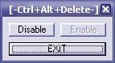



## I\~\*Ctrl\+Alt\+Delete Disable\!\*\~\*I \(Works With All Windows\)

### Description

Disable Windows Task Manager (Ctrl+Alt+Del)
 
### More Info
 
Works With All Windows ;o)

             |
---                |---
**Submitted On**   |2004-03-11 02:56:02
**By**             |[\-W\|tch\-Doct0r\-](https://github.com/Planet-Source-Code/PSCIndex/blob/master/ByAuthor/w-tch-doct0r.md)
**Level**          |Beginner
**User Rating**    |2.9 (20 globes from 7 users)
**Compatibility**  |VB 6\.0
**Category**       |[Miscellaneous](https://github.com/Planet-Source-Code/PSCIndex/blob/master/ByCategory/miscellaneous__1-1.md)
**World**          |[Visual Basic](https://github.com/Planet-Source-Code/PSCIndex/blob/master/ByWorld/visual-basic.md)
**Archive File**   |[I\~\_Ctrl\+Al1718953112004\.ZIP](https://github.com/Planet-Source-Code/w-tch-doct0r-i-ctrl-alt-delete-disable-i-works-with-all-windows__1-52303/archive/master.zip)

